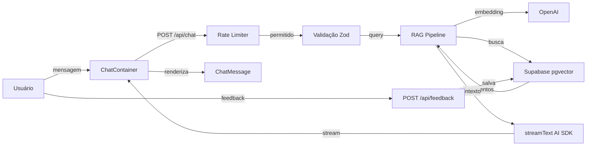

# Guia do Desenvolvedor — SOFIA

Sistema de Orientação Funcional e Informação Administrativa para a ASOF.

---

## 1. Configuração do Ambiente

### Matriz de Versões

| Componente | Versão Mínima | Observação |
|---|---|---|
| Node.js | 18.17+ | Recomendado: 22+ (LTS) |
| npm | 9.x+ | Vem com Node.js |
| Supabase | PostgreSQL 15+ | Extensão pgvector habilitada |
| OpenAI API Key | — | Necessária para embeddings e LLM em dev |

### Pré-requisitos

- Node.js 18.17 ou superior ([nodejs.org](https://nodejs.org))
- npm (incluído com Node.js)
- Conta no [Supabase](https://supabase.com) com projeto configurado
- Chave de API da [OpenAI](https://platform.openai.com/api-keys)

### Variáveis de Ambiente

Crie `.env.local` na raiz do projeto:

```env
# Supabase (obrigatório)
NEXT_PUBLIC_SUPABASE_URL=https://seu-projeto.supabase.co
NEXT_PUBLIC_SUPABASE_ANON_KEY=sua-chave-anonima
SUPABASE_SERVICE_ROLE_KEY=sua-chave-service-role

# OpenAI (obrigatório em dev)
OPENAI_API_KEY=sk-...

# Em produção via Vercel AI Gateway:
# VERCEL_OIDC_TOKEN é provisionado automaticamente pelo vercel env pull
```

| Variável | Obrigatória | Descrição |
|---|---|---|
| `NEXT_PUBLIC_SUPABASE_URL` | Sim | URL do projeto Supabase |
| `NEXT_PUBLIC_SUPABASE_ANON_KEY` | Sim | Chave anônima (exposta ao client) |
| `SUPABASE_SERVICE_ROLE_KEY` | Sim | Chave de serviço (server-only, acesso total) |
| `OPENAI_API_KEY` | Sim (dev) | Para LLM e embeddings em desenvolvimento local |
| `VERCEL_OIDC_TOKEN` | Não (auto) | Provisionado automaticamente em produção via AI Gateway |

### Instalação

```bash
# Clonar o repositório
git clone <url-do-repositorio>
cd v0-sofia

# Instalar dependências
npm install

# Configurar variáveis de ambiente
cp .env.example .env.local
# Edite .env.local com suas chaves

# Configurar banco de dados (veja seção abaixo)

# Iniciar servidor de desenvolvimento
npm run dev
# Acesse http://localhost:3000
```

### Configuração do Banco de Dados

Execute os scripts SQL **em ordem** no [Supabase SQL Editor](https://supabase.com/dashboard/project/_/sql):

```bash
# 1. Cria tabelas, funções RPC e índices
#    scripts/001_create_sofia_tables.sql

# 2. Popula dados de exemplo com embeddings
#    scripts/002_seed_sample_documents.sql

# 3. Corrige tabela de feedback (se necessário)
#    scripts/003_fix_feedback_table.sql
```

Verifique a extensão pgvector está habilitada:

```sql
CREATE EXTENSION IF NOT EXISTS vector WITH SCHEMA extensions;
```

### Verificação

Após a configuração, confirme que tudo está funcionando:

```bash
# Testes unitários devem passar (80 testes)
npm run test

# Servidor deve iniciar sem erros
npm run dev

# Verificar documentos no banco (via Supabase Dashboard > SQL Editor)
SELECT COUNT(*) FROM documents;
```

---

## 2. Estrutura do Projeto

### Arquitetura



### Diretórios

```text
v0-sofia/
├── app/                              # Next.js App Router
│   ├── api/
│   │   ├── chat/route.ts             # Endpoint principal (RAG + streaming)
│   │   └── feedback/route.ts         # Endpoint de feedback
│   ├── globals.css                   # Design tokens ASOF + animações
│   ├── layout.tsx                    # Layout raiz (metadata, fontes, Analytics)
│   └── page.tsx                      # Página principal (renderiza ChatContainer)
│
├── components/
│   ├── sofia/                        # Componentes de domínio
│   │   ├── chat-container.tsx        # useChat, sessão, feedback
│   │   ├── chat-message.tsx          # Renderização (react-markdown + citações)
│   │   ├── chat-input.tsx            # Input com auto-resize
│   │   ├── message-list.tsx          # Lista com auto-scroll
│   │   ├── header.tsx                # Logo ASOF + tema dark/light
│   │   └── welcome-screen.tsx        # Sugestões de perguntas
│   ├── ui/                           # Componentes shadcn/ui (não editar manualmente)
│   ├── icons/                        # Ícones SVG inline
│   └── theme-provider.tsx            # Provider de tema (next-themes)
│
├── lib/
│   ├── rag.ts                        # RAG: embed, busca, contexto, salvar
│   ├── schemas.ts                    # Validação Zod (chat, feedback)
│   ├── rate-limit.ts                 # Rate limiter sliding window
│   ├── utils.ts                      # cn() — clsx + tailwind-merge
│   ├── chat/
│   │   ├── constants.ts              # CHAT_CONFIG (modelo, thresholds)
│   │   ├── system-prompt.ts          # Prompt do sistema com placeholders
│   │   └── asof-data.ts             # Dados institucionais da ASOF
│   ├── errors/
│   │   └── handler.ts                # SofIAError, handleError
│   └── supabase/
│       ├── client.ts                 # Cliente browser (anon key)
│       └── server.ts                 # Cliente server (service role)
│
├── __tests__/                        # Testes unitários (Vitest, 80 testes)
│   ├── api/                          # Testes de API routes
│   ├── lib/                          # Testes de módulos lib
│   │   ├── chat/                     # Testes de chat/constants, system-prompt
│   │   └── errors/                   # Testes de error handler
│   ├── rag.test.ts
│   ├── schemas.test.ts
│   └── rate-limit.test.ts
│
├── e2e/                              # Testes E2E (Playwright, 11 testes)
│   ├── chat.spec.ts                  # Fluxo completo de chat
│   └── chat_page_object.ts           # Page Object Model
│
├── scripts/                          # Scripts SQL para Supabase
│   ├── 001_create_sofia_tables.sql
│   ├── 002_seed_sample_documents.sql
│   └── 003_fix_feedback_table.sql
│
├── docs/                             # Documentação
├── public/                           # Assets estáticos (favicons, logos)
└── styles/                           # (reservado, vazio)
```

### Stack Tecnológico

| Tecnologia | Versão | Uso |
|---|---|---|
| Next.js | 16.2 | Framework com App Router |
| React | 19 | UI (Server + Client Components) |
| AI SDK | 6.0 | Chat (useChat, streamText) |
| @ai-sdk/react | 3.0 | Hooks React (useChat, DefaultChatTransport) |
| @ai-sdk/openai | 3.0 | Provider OpenAI |
| Supabase | 2.101 | PostgreSQL + pgvector |
| Tailwind CSS | 4.2 | Estilização |
| shadcn/ui | — | Componentes de interface |
| Vitest | 3.2 | Testes unitários |
| Playwright | — | Testes E2E |
| Zod | 3.24 | Validação de schemas |
| react-markdown | 10.1 | Renderização de markdown |
| @vercel/analytics | — | Analytics |

### Principais Módulos (`lib/`)

| Módulo | Responsabilidade |
|---|---|
| `rag.ts` | Pipeline RAG: gera embeddings, busca vetorial/textual, formata contexto, salva mensagens |
| `schemas.ts` | Schemas Zod para validação de requests (chat e feedback) |
| `rate-limit.ts` | Rate limiter in-memory com sliding window (20 req/min chat, 30 req/min feedback) |
| `errors/handler.ts` | Classes de erro (SofIAError, ValidationError, DatabaseError) e handler unificado |
| `chat/constants.ts` | Configuração: modelo LLM, modelo de embeddings, thresholds de busca |
| `chat/system-prompt.ts` | Template do prompt com placeholders `{context}` e `{asofData}` |
| `chat/asof-data.ts` | Dados institucionais da ASOF (diretoria, sede, contato) |
| `supabase/client.ts` | Cliente Supabase para browser (anon key) |
| `supabase/server.ts` | Cliente Supabase para server (service role, cookies SSR) |

### Esquema do Banco de Dados

```text
documents                    # Chunks de documentos normativos
├── id (uuid, PK)
├── content (text)
├── embedding (vector 1536)  # pgvector — nulo = busca textual
├── metadata (jsonb)
├── source_title (text)
├── source_type (enum: lei | decreto | portaria | instrucao_normativa | parecer | outros)
├── article_number (text)
└── created_at (timestamptz)

chat_sessions                # Sessões de conversa
├── id (uuid, PK)
├── session_id (text, unique)
└── created_at (timestamptz)

chat_messages                # Mensagens do chat
├── id (uuid, PK)
├── session_id (text, FK → chat_sessions.session_id)
├── role (text: user | assistant)
├── content (text)
├── sources (jsonb)
└── created_at (timestamptz)

feedback                     # Avaliações das respostas
├── id (uuid, PK)
├── message_id (uuid, FK → chat_messages.id)
├── session_id (text)
├── rating (text: positive | negative)
└── created_at (timestamptz)
```

---

## 3. Fluxo de Trabalho de Desenvolvimento

### Fluxo de uma Requisição de Chat

```text
1. Usuário envia mensagem
   └─> ChatInput.tsx → sendMessage({ text })

2. useChat (AI SDK) envia para API
   └─> POST /api/chat { message, sessionId }

3. Rate limiter verifica IP
   └─> chatLimiter.check(ip) → permitido/bloqueado

4. Validação Zod do request
   └─> chatRequestSchema.parse(body)

5. Pipeline RAG
   ├─> searchDocuments(query)
   │   ├─> checkHasEmbeddings() (cache 60s)
   │   ├─> Sem embeddings → busca textual (textSearch)
   │   └─> Com embeddings → busca vetorial (match_documents RPC)
   ├─> formatContext(docs) → contexto formatado
   └─> formatSystemPrompt(context) → prompt completo

6. Geração de resposta (AI SDK)
   └─> streamText({ model, system prompt, messages })
       → toUIMessageStreamResponse()

7. Resposta em streaming
   └─> ChatMessage.tsx renderiza via react-markdown

8. Pós-streaming
   └─> saveMessage() — salva user + assistant no banco (fire-and-forget)

9. Feedback (opcional)
   └─> POST /api/feedback { messageId, sessionId, rating }
```

### Git Workflow

- Branch principal: `main`
- Branches de feature: `feature/nome-descritivo`
- Commits em português (pt-BR) com `Co-Authored-By`
- Rodar `npm run test` antes de cada commit

```bash
# Criar branch de feature
git checkout -b feature/adicionar-citacoes

# Desenvolver e testar
npm run test

# Commit
git add <arquivos>
git commit -m "feat: adiciona citações normativas nas respostas do chat"

# Push e PR
git push -u origin feature/adicionar-citacoes
```

### Modificando o System Prompt

O prompt do sistema está em `lib/chat/system-prompt.ts`. Ao modificar:

1. Mantenha o tom formal e institucional
2. Preserve os placeholders `{context}` e `{asofData}`
3. Não remova as diretrizes de limitações e restrições de linguagem
4. Teste com diferentes tipos de perguntas após a alteração

### Adicionando Documentos ao RAG

```sql
-- Sem embedding (busca textual via textSearch)
INSERT INTO documents (content, source_title, source_type, article_number)
VALUES (
  'Texto do documento normativo...',
  'Lei nº 11.440/2006',
  'lei',
  'Art. 5º'
);

-- Com embedding (busca semântica)
-- Gere o embedding via generateEmbedding() em lib/rag.ts
-- e insira com a coluna embedding preenchida
```

### Adicionando um Novo Componente

1. Criar em `components/sofia/` com `'use client'`
2. Usar `cn()` de `@/lib/utils` para classes Tailwind
3. Adicionar `data-testid` para testes
4. Importar e usar no componente pai

### Adicionando um Novo Endpoint de API

1. Criar `app/api/[nome]/route.ts`
2. Validar input com Zod (schema em `lib/schemas.ts`)
3. Usar `handleError()` de `lib/errors/handler.ts` para erros
4. Aplicar rate limiting se necessário

---

## 4. Testes

### Testes Unitários (Vitest)

```bash
# Rodar todos os testes
npm run test

# Modo watch (desenvolvimento)
npm run test:watch

# Relatório de cobertura
npx vitest run --coverage
```

**80 testes em 8 arquivos:**

| Arquivo | Testes | O que testa |
|---|---|---|
| `lib/schemas.test.ts` | 21 | Validação Zod de chat e feedback |
| `lib/errors/handler.test.ts` | 10 | SofIAError, ValidationError, handleError |
| `lib/chat/system-prompt.test.ts` | 10 | Substituição de placeholders no prompt |
| `lib/rag.test.ts` | 8 | Embeddings, busca, formatação de contexto |
| `lib/rate-limit.test.ts` | 8 | Sliding window, cleanup, limites |
| `lib/chat/asof-data.test.ts` | 8 | Dados institucionais, formatação markdown |
| `api/feedback-route.test.ts` | 8 | Validação, inserção, 404 |
| `api/chat-route.test.ts` | 7 | Validação, RAG mockado, streaming |

### Testes E2E (Playwright)

```bash
# Rodar todos os testes E2E
npx playwright test

# Modo UI interativo
npx playwright test --ui

# Modo debug
npx playwright test --debug

# URL customizada
PLAYWRIGHT_BASE_URL=http://localhost:3000 npx playwright test
```

**11 testes em `e2e/chat.spec.ts`:**
- Welcome screen com sugestões
- Envio de mensagem e resposta do assistente
- Streaming de resposta longa
- Botões de feedback (positivo/negativo)
- Sugestões de perguntas
- Responsividade mobile
- Touch targets

### Boas Práticas de Testes

- Rodar `npm run test` antes de cada commit
- Mockar dependências externas (Supabase, OpenAI, AI SDK)
- Usar `vi.clearAllMocks()` no `beforeEach`
- Seletores via `data-testid` (padrão: `kebab-case`)

---

## 5. Troubleshooting

### Erros do AI SDK

**"Model not found"**
- Causa: Modelo configurado em `lib/chat/constants.ts` não disponível
- Solução: Verifique `CHAT_CONFIG.MODEL` e a chave `OPENAI_API_KEY`

**Streaming interrompido**
- Causa: Timeout ou erro no provider
- Solução: Verifique logs do servidor (`vercel logs` em produção)

**"convertToModelMessages" type error**
- Causa: Formato de `UIMessage` incompatível com o schema Zod
- Solução: O cast `as any` em `app/api/chat/route.ts` resolve temporariamente

### Erros de Rate Limiting

**Resposta 429 (muitas requisições)**
- Causa: Limite de 20 req/min para chat excedido
- Solução: Aguarde o tempo em `resetAt` retornado no header da resposta

**Rate limiter não funciona entre deploys**
- Causa: Estado in-memory, perdido em cold starts
- Solução: Comportamento esperado em serverless. Para persistência, use Redis

### Erros de Embedding

**"OPENAI_API_KEY not configured"**
- Causa: Variável de ambiente ausente
- Solução: Configure `OPENAI_API_KEY` em `.env.local`

**"embedding column does not exist"**
- Causa: Extensão pgvector não habilitada
- Solução: `CREATE EXTENSION IF NOT EXISTS vector WITH SCHEMA extensions;`

**"match_documents function not found"**
- Causa: Script de migração não executado
- Solução: Re-execute `scripts/001_create_sofia_tables.sql`

**Timeout na geração de embeddings**
- Causa: Muitos documentos ou API lenta
- Solução: Processe em lotes menores, use `Promise.allSettled`

### Respostas sem Citações Normativas

- Causa: Documentos sem embedding ou threshold muito alto
- Solução:
  1. `SELECT COUNT(*) FROM documents WHERE embedding IS NOT NULL`
  2. Reduza `SIMILARITY_THRESHOLD` em `lib/chat/constants.ts` (padrão: 0.7)
  3. Adicione mais documentos relevantes

### Chat Não Salva Histórico

- Causa: Sessão não criada ou erro de foreign key
- Solução:
  ```sql
  SELECT * FROM chat_sessions WHERE session_id = 'seu-session-id';
  ```

### Feedback Não Funciona

- Causa: `message_id` inválido ou mensagem inexistente
- Solução: Verifique se a mensagem existe no banco via Supabase Dashboard

### Interface Não Carrega no Mobile

- Causa: Erro de JavaScript ou CSS incompatível
- Solução:
  1. Safari DevTools (modo iPhone)
  2. Verifique `viewport` em `app/layout.tsx`
  3. Confirme classes Tailwind válidas

### Dependências Não Instaladas

```bash
# Limpar e reinstalar
rm -rf node_modules package-lock.json
npm install
```

---

## 6. Deploy

### Vercel (Produção)

O projeto é configurado para deploy zero-config na Vercel.

```bash
# Instalar Vercel CLI
npm i -g vercel@latest

# Conectar ao projeto
vercel link

# Configurar variáveis de ambiente
vercel env pull  # puxa variáveis + VERCEL_OIDC_TOKEN

# Deploy de preview
vercel

# Deploy de produção
vercel --prod
```

### AI Gateway em Produção

Em produção, o modelo LLM roteia automaticamente pelo **Vercel AI Gateway**:

- `VERCEL_OIDC_TOKEN` é provisionado automaticamente via `vercel env pull`
- Nenhuma chave de API direta necessária em produção
- Failover automático entre providers
- Tracking de custo e observabilidade integrados

Para desenvolvimento local com AI Gateway:
1. Habilite AI Gateway no dashboard Vercel
2. `vercel env pull` para obter `VERCEL_OIDC_TOKEN`
3. Use `model: 'openai/gpt-4o-mini'` (string roteia automaticamente)

---

## Referências

- [AI SDK](https://sdk.vercel.ai/docs) — Chat, streaming, tool calling
- [Supabase](https://supabase.com/docs) — PostgreSQL, pgvector, RLS
- [Next.js](https://nextjs.org/docs) — App Router, Server Components
- [Tailwind CSS](https://tailwindcss.com/docs) — Estilização
- [shadcn/ui](https://ui.shadcn.com/docs) — Componentes
- [Vercel AI Gateway](https://vercel.com/docs/ai-gateway) — Roteamento de modelos
- [Vitest](https://vitest.dev) — Testes unitários
- [Playwright](https://playwright.dev) — Testes E2E

Para questões sobre a carreira de Oficial de Chancelaria, entre em contato com a ASOF: contato@asof.org.br.
