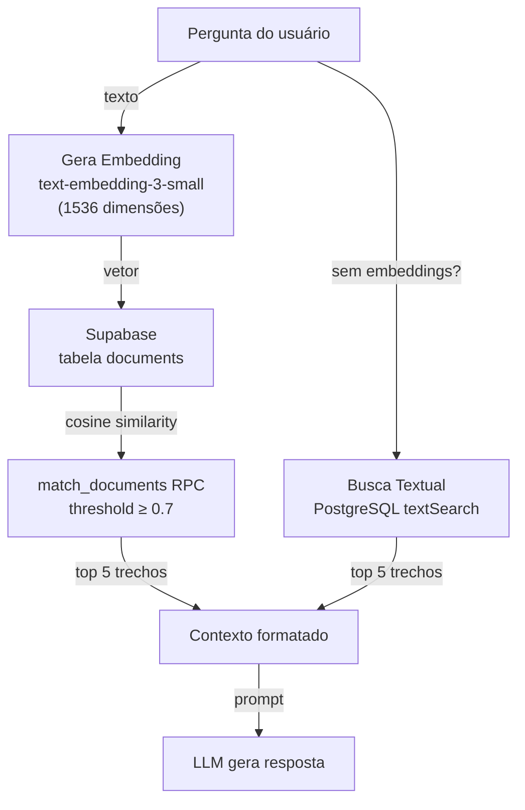

# Guia de Atualização do RAG — SOFIA

Manual para gerenciar a base de conhecimento do SOFIA: adicionar documentos, gerar embeddings e configurar a busca.

---

## 1. Visão Geral

### Como o RAG Funciona



### Busca Híbrida

O sistema opera em dois modos:

| Modo | Quando | Método | Performance |
|------|-------|--------|-------------|
| **Vetorial** | Documentos possuem embedding | `match_documents` RPC (cosine similarity) | Alta precisão |
| **Textual** | Nenhum embedding no banco | PostgreSQL `textSearch` (websearch) | Precisão menor |

A verificação é cacheada por 60 segundos (`unstable_cache`). Se embeddings forem adicionados, o sistema alterna automaticamente para busca vetorial.

### Componentes Envolvidos

| Arquivo | Responsabilidade |
|---------|-----------------|
| `lib/rag.ts` | Pipeline RAG: `generateEmbedding()`, `searchDocuments()`, `formatContext()` |
| `lib/chat/constants.ts` | `CHAT_CONFIG`: modelo, threshold, max results |
| `scripts/001_create_sofia_tables.sql` | Tabela `documents`, índice IVFFlat, RPC `match_documents` |
| `scripts/002_seed_sample_documents.sql` | Dados de exemplo (sem embeddings) |

---

## 2. Estrutura da Tabela `documents`

### Schema

```sql
CREATE TABLE documents (
  id            UUID PRIMARY KEY DEFAULT gen_random_uuid(),
  content       TEXT NOT NULL,
  embedding     VECTOR(1536),            -- nulo = busca textual, preenchido = busca vetorial
  metadata      JSONB DEFAULT '{}',
  source_title  TEXT,
  source_type   TEXT CHECK (source_type IN ('lei', 'decreto', 'portaria', 'instrucao_normativa', 'parecer', 'outros')),
  article_number TEXT,
  created_at    TIMESTAMPTZ DEFAULT NOW(),
  updated_at    TIMESTAMPTZ DEFAULT NOW()
);
```

### Índices

| Índice | Tipo | Uso |
|--------|------|-----|
| `documents_embedding_idx` | IVFFlat (100 lists) | Busca vetorial por similaridade de cosseno |
| `documents_source_type_idx` | B-tree | Filtro por tipo de documento |

### Tipo de Documento (`source_type`)

| Valor | Descrição | Exemplo |
|-------|-----------|---------|
| `lei` | Lei ordinária | Lei nº 11.440/2006 |
| `decreto` | Decreto regulamentar | Decreto nº 9.817/2019 |
| `portaria` | Portaria ministerial | Portaria MRE nº 775 |
| `instrucao_normativa` | Instrução normativa | IN SRF nº 2.180/2022 |
| `parecer` | Parecer jurídico | Parecer AGU |
| `outros` | Outros documentos | Resoluções, circulares |

### Formato do Embedding

- **Modelo**: `text-embedding-3-small` (OpenAI)
- **Dimensões**: 1536
- **Tipo**: `vector(1536)` (pgvector)
- **Distância**: Cosine (operador `<=>`)

---

## 3. Adicionando Documentos

### Opção A: Sem Embedding (Busca Textual)

Documentos inseridos sem embedding participam apenas da busca textual. Adequado para documentos curtos ou quando a busca vetorial não é necessária.

```sql
INSERT INTO documents (content, source_title, source_type, article_number)
VALUES (
  'Texto completo do documento normativo aqui...',
  'Lei nº 11.440/2006',
  'lei',
  'Art. 5º'
);
```

### Opção B: Com Embedding (Busca Semântica)

Documentos com embedding participam da busca vetorial, que é mais precisa. O embedding precisa ser gerado via API OpenAI.

**Passo 1 — Inserir sem embedding:**

```sql
INSERT INTO documents (content, source_title, source_type, article_number)
VALUES (
  'Texto completo do documento normativo aqui...',
  'Lei nº 11.440/2006',
  'lei',
  'Art. 5º'
);
```

**Passo 2 — Gerar embedding e atualizar (veja seção 4):**

```sql
UPDATE documents
SET embedding = '[0.0123, -0.0345, ...]'  -- vetor de 1536 dimensões
WHERE id = '<uuid-do-documento>';
```

### Boas Práticas para Chunking

- **Tamanho**: 500 a 1500 caracteres por chunk (equilíbrio entre contexto e granularidade)
- **Artigos**: Um chunk por artigo, quando possível
- **Sobreposição**: Inclua contexto do artigo anterior no início do próximo chunk
- **Metadados**: Use `metadata` JSONB para armazenar info extra (número, seção, data)
- **Artigo Number**: Sempre preencher `article_number` para facilitar referência

### Exemplo Completo com Metadados

```sql
INSERT INTO documents (content, source_title, source_type, article_number, metadata)
VALUES (
  'Art. 5º São Oficiais de Chancelaria, distribuídos em classes, conforme quadro anexo a este diploma.',
  'Lei nº 11.440/2006',
  'lei',
  'Art. 5º',
  '{"lei": "11.440/2006", "secao": "Capítulo III", "palavras_chave": ["classe", "distribuicao"]}'
);
```

---

## 4. Gerando Embeddings

### Via API OpenAI (Manual)

```bash
curl https://api.openai.com/v1/embeddings \
  -H "Authorization: Bearer $OPENAI_API_KEY" \
  -H "Content-Type: application/json" \
  -d '{
    "model": "text-embedding-3-small",
    "input": "Texto do documento para gerar embedding..."
  }'
```

A resposta inclui um campo `data[0].embedding` — um array de 1536 números floats.

### Via Script Node.js (Recomendado para Lotes)

Crie um script `scripts/generate-embeddings.mjs`:

```javascript
import { createOpenAI } from '@ai-sdk/openai';
import { embed } from 'ai';
import { createClient } from '@supabase/supabase-js';

const openai = createOpenAI({ apiKey: process.env.OPENAI_API_KEY });
const supabase = createClient(
  process.env.NEXT_PUBLIC_SUPABASE_URL,
  process.env.SUPABASE_SERVICE_ROLE_KEY
);

async function generateEmbedding(text) {
  const { embedding } = await embed({
    model: openai.textEmbeddingModel('text-embedding-3-small'),
    value: text,
  });
  return embedding;
}

async function main() {
  // Buscar documentos sem embedding
  const { data: docs, error } = await supabase
    .from('documents')
    .select('id, content')
    .is('embedding', 'is', null);

  if (error) throw error;
  console.log(`Encontrados ${docs.length} documentos sem embedding.`);

  for (const doc of docs) {
    try {
      const embedding = await generateEmbedding(doc.content);
      const { error: updateError } = await supabase
        .from('documents')
        .update({ embedding })
        .eq('id', doc.id);

      if (updateError) {
        console.error(`Erro ao atualizar ${doc.id}:`, updateError.message);
      } else {
        console.log(`✓ ${doc.id} — ${doc.content.substring(0, 50)}...`);
      }

      // Rate limit: OpenAI permite ~3000 req/min para embeddings
      await new Promise(r => setTimeout(r, 100));
    } catch (err) {
      console.error(`Erro ao gerar embedding para ${doc.id}:`, err.message);
    }
  }
  console.log('Concluído.');
}

main();
```

Executar:

```bash
npx tsx scripts/generate-embeddings.mjs
```

### Verificando Embeddings

```sql
-- Contar documentos com embedding
SELECT COUNT(*) AS com_embedding
FROM documents
WHERE embedding IS NOT NULL;

-- Contar documentos sem embedding
SELECT COUNT(*) AS sem_embedding
FROM documents
WHERE embedding IS NULL;

-- Total de documentos
SELECT COUNT(*) AS total FROM documents;
```

---

## 5. Atualizando Documentos

### Atualizando Conteúdo

```sql
UPDATE documents
SET
  content = 'Novo texto atualizado do documento...',
  metadata = '{"atualizado_em": "2026-04-06"}',
  updated_at = now()
WHERE id = '<uuid-do-documento>';
```

### Regenerando Embeddings Após Atualização

**Importante**: Sempre regenere o embedding após alterar o conteúdo, caso contrário a busca vetorial retornará resultados desatualizados.

```bash
# 1. Atualize o conteúdo no banco (SQL acima)
# 2. Atualize o embedding do documento específico

npx tsx scripts/generate-embeddings.mjs
```

Ou para um único documento via SQL + API:

```bash
# Gerar novo embedding do texto atualizado
curl https://api.openai.com/v1/embeddings \
  -H "Authorization: Bearer $OPENAI_API_KEY" \
  -H "Content-Type: application/json" \
  -d '{"model": "text-embedding-3-small", "input": "Novo texto atualizado..."}' \
  | jq '.data[0].embedding' > /tmp/embedding.json

# Atualizar no banco
UPDATE documents
SET embedding = (SELECT '[0.0123, -0.0345, ...]'::vector)
WHERE id = '<uuid-do-documento>';
```

### Removendo Documentos

```sql
-- Remover documento específico
DELETE FROM documents WHERE id = '<uuid-do-documento>';

-- Remover todos os documentos de um tipo
DELETE FROM documents WHERE source_type = 'decreto';

-- Remover todos os documentos (cuidado!)
DELETE FROM documents;
```

---

## 6. Configuração do RAG

### Parâmetros em `lib/chat/constants.ts`

```typescript
export const CHAT_CONFIG = {
  MODEL: 'gpt-5.4-nano',
  EMBEDDING_MODEL: 'text-embedding-3-small',
  SIMILARITY_THRESHOLD: 0.7,
  MAX_RESULTS: 5,
} as const
```

### Ajustando o Threshold de Similaridade

| Threshold | Efeito |
|-----------|--------|
| `0.5` | Mais resultados, menor precisão (pode retornar irrelevantes) |
| `0.7` (padrão) | Equilíbrio entre precisão e recall |
| `0.8` | Menos resultados, maior precisão (pode perder resultados relevantes) |
| `0.9` | Apenas resultados muito similares (poucos resultados) |

### Ajustando a Quantidade de Resultados

| MAX_RESULTS | Efeito |
|-------------|--------|
| `3` | Respostas mais focadas, menor contexto |
| `5` (padrão) | Bom equilíbrio |
| `10` | Mais contexto, mas pode confundir o LLM |

### Quando Ajustar

- **Threshold muito alto**: respostas genéricas sem citações normativas
- **Threshold muito baixo**: respostas com documentos irrelevantes
- **MAX_RESULTS muito alto**: respostas longas com conteúdo misto
- **MAX_RESULTS muito baixo**: respostas sem contexto suficiente

---

## 7. Troubleshooting

### Documentos Não Aparecem nas Respostas

```sql
-- 1. Verificar se documentos existem
SELECT COUNT(*) FROM documents;

-- 2. Verificar se possuem embeddings
SELECT COUNT(*) FROM documents WHERE embedding IS NOT NULL;

-- 3. Verificar conteúdo de exemplo
SELECT id, source_title, source_type, LEFT(content, 100) FROM documents LIMIT 5;
```

**Soluções possíveis:**
- Documentos existem mas sem embedding → gere embeddings (seção 4)
- Nenhum documento → adicione documentos (seção 3)
- Embeddings existem mas threshold alto → reduza `SIMILARITY_THRESHOLD`

### Busca Retornando Resultados Irrelevantes

**Causa**: Busca textual ativa (sem embeddings) ou threshold muito baixo.

**Soluções:**
1. Gere embeddings para os documentos (seção 4)
2. Aumente `SIMILARITY_THRESHOLD` em `lib/chat/constants.ts`
3. Melhore o conteúdo dos documentos (mais específico, menos genérico)

### Erro ao Gerar Embeddings

**"OPENAI_API_KEY not configured"**
```bash
# Verificar se a variável está configurada
echo $OPENAI_API_KEY
```

**Timeout na geração de embeddings**
- Processe documentos em lotes menores (5-10 por vez)
- Adicione delay entre requisições (100ms)
- Verifique o limite da sua chave API OpenAI

### Respostas Sem Citações Normativas

- Verifique se `SIMILARITY_THRESHOLD` está muito alto
- Confirme que os documentos cobrem o tema da pergunta
- Verifique se `MAX_RESULTS` é suficiente (tente 10)

### Verificação Rápida no Supabase

```sql
-- Status geral do RAG
SELECT
  (SELECT COUNT(*) FROM documents) AS total_docs,
  (SELECT COUNT(*) FROM documents WHERE embedding IS NOT NULL) AS com_embedding,
  (SELECT COUNT(*) FROM documents WHERE embedding IS NULL) AS sem_embedding;

-- Últimos documentos adicionados
SELECT id, source_title, source_type, created_at
FROM documents
ORDER BY created_at DESC
LIMIT 10;

-- Distribuição por tipo
SELECT source_type, COUNT(*) AS count
FROM documents
GROUP BY source_type
ORDER BY count DESC;
```
